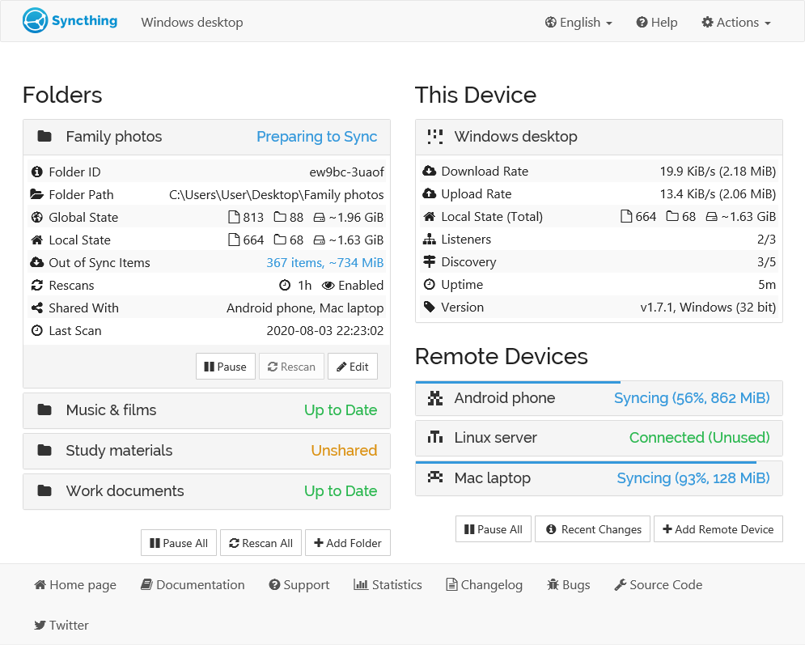

An Intro to the GUI
===================

Folder View
-----------

The left side of the screen shows the ID and current state of all
configured folders. Clicking the folder name makes that section expand
to show more detailed folder information, and buttons for pausing the
folder, forcing a rescan, or editing the configuration.

A folder can be in any one of these states:

Unknown
	while the GUI is loading,

Unshared
	when you have not shared this folder yet,

Paused
	when the folder's activity has been put on hold,

Stopped
	when the folder has experienced an error,

Up to Date
	when the folder is in sync with the rest of the devices,

Waiting to Scan
	when waiting for other folders to idle before scanning the folder,

Scanning
	while Syncthing is looking in the folder for local changes,

Waiting to Sync
	when waiting for other folders to idle before syncing the folder,

Preparing to Sync
	when Syncthing is gathering file changes to synchronize,

Syncing
	when this device is downloading changes from the network,

Waiting to Clean
	when waiting for the folder to idle before cleaning versions,

Cleaning Versions
	while removing obsolete files from the .stversions folder.

Local Additions
	when locally added or modified items are present in a receive-only
	folder, thus not synced to remote machines.  The red button "Revert
	Local Changes" will revert and delete all local changes to the state
	advertised by remote devices.

Among the folder details, you can see the current "Global State" and
"Local State" summaries, as well as the amount of "Out of Sync" data if
the folder state is not up to date.

Global State
	indicates how much data the fully up to date folder contains, which is
	basically the sum of the newest versions of all files from all
	connected devices. This is the size of the folder on your computer
	when it is fully in sync with the remote devices.

Local State
	shows how much data the folder actually contains right now. This can
	be more or less than the global state, if the folder is currently
	synchronizing with other devices.

Out of Sync
	shows how much data needs to be synchronized from other devices. Note
	that this is the sum of all out of sync *files* - if you already have
	parts of such a file, or an older version of the file, less data than
	this will need to be transferred over the network.

Error
	describes the problem when the folder is in state Stopped. One
	possible message is "folder marker missing". This means that the root
	directory of this folder does not contain a file or directory called
	``.stfolder`` (marker). Syncthing stops when this marker goes missing
	to prevent data loss e.g. when the folder path was unmounted. If the
	marker was deleted accidentally, just recreate it and press the rescan
	button in the UI.

Creating a new synced folder
~~~~~~~~~~~~~~~~~~~~~~~~~~~~

Use the Syncthing Web interface. Click the "Add Folder" button which
will bring up a dialogue with the following options:

Folder Label
	should be set to something descriptive. This label will initially
	be shared with remote devices, but can be changed on each device, as
	desired.

Folder ID
	has to be the same across all devices, as it is the unique identifier
	of the folder. Best practice is to keep the auto-generated ID to avoid
	conflicts with equally named folders on other devices.

Folder Path
	designates the physical path to the folder, i.e. on your hard drive.

Next select with which devices to share the folder with and press add,
which will add the folder and start syncing.

Device View
-----------

The right side of the screen shows the overall state of all configured
devices. The local device is always at the top, with remote devices in
alphabetical order below. For each device you see its current state and,
when expanded, more detailed information. All transfer rates ("Download
Rate" and "Upload Rate") are from the perspective of the local device,
even those shown for remote devices. The rates for the local device are
the sum of those for the remote devices. For each rate, you can see the
current transfer speed, followed by the total amount of data transferred
so far. You can click the current transfer speed to toggle the units
between bytes and bits.

