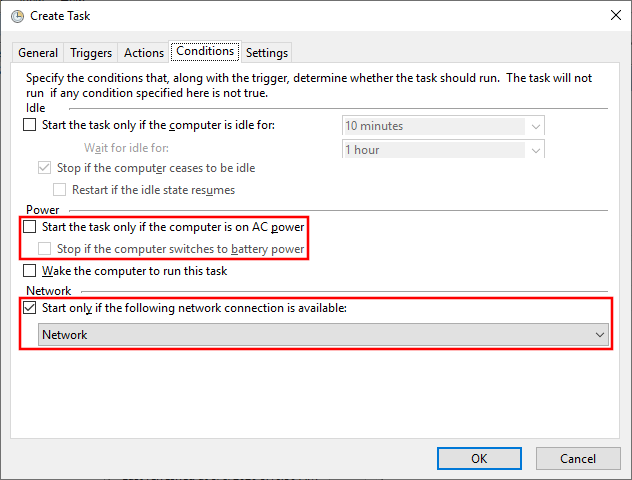
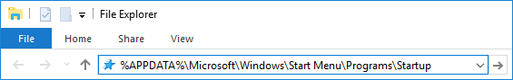
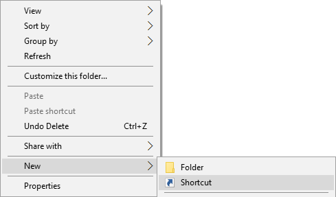
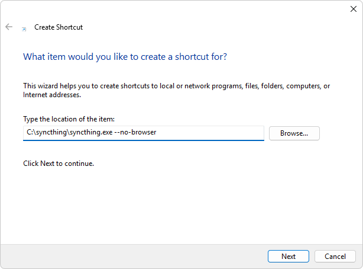

Starting Syncthing Automatically
================================

Jump to configuration for your system:

- `Windows`_
- `macOS`_
- `Linux`_

Windows
-------

There is currently no official installer available for Windows. However,
there are a number of easy solutions.

Built-in solutions:

- :ref:`Run at user log on or at system startup using Task Scheduler <autostart-windows-taskschd>`
- :ref:`Run at user log on using the Startup folder <autostart-windows-startup>`

Other solutions:

- :ref:`Install and run using third-party tools <autostart-windows-tools>`
- :ref:`Run as a service independent of user log on <autostart-windows-service>`

.. _autostart-windows-taskschd:

Run at user log on or at system startup using Task Scheduler
~~~~~~~~~~~~~~~~~~~~~~~~~~~~~~~~~~~~~~~~~~~~~~~~~~~~~~~~~~~~

Task Scheduler is a built-in administrative tool, which can be used to
start Syncthing automatically either at user log on, or at system
startup. In both cases, Syncthing will open and stay invisible in
background.

For technical information about Task Scheduler visit
https://docs.microsoft.com/windows/win32/taskschd.

#. Start the Task Scheduler either by going to ``Start Menu > Windows
   Administrative Tools`` and clicking on ``Task Scheduler``, or by
   opening ``taskschd.msc`` from the Run command (``Win+R``).

#. Create a new Task ("Actions" sidebar > "Create Task...").

   |Windows Task Scheduler Create Task Screenshot|

#. General tab:

   #. Name the task (for example "Syncthing").
   #. Select "Run whether user is logged on or not".

   |Windows Task Scheduler General Screenshot|

#. Triggers tab:

   Syncthing can be set up to start either at user log on, or at system
   startup. Pick your preferred method and follow the instructions
   below. If unsure, read the explanations underneath each of the two
   options.

   - Run at user log on

     Choose this option if you intend to use Syncthing only when being
     logged on to your Windows user account.

     #. Click "New...".
     #. Set "Begin the task:" to "At log on".
     #. Select "Specific user:"
     #. Click "OK".

     |Windows Task Scheduler Triggers Logon Screenshot|

   - Run at system startup

     Choose this option if you want Syncthing to open in background as
     soon as Windows starts, and even when not being logged on to your
     user account. Do not use this method if your Syncthing folders are
     stored on a non-system partition protected by BitLocker, as they
     will be inaccessible before user log on.

     #. Click "New...".
     #. Set "Begin the task:" to "At startup".
     #. Click "OK".

     |Windows Task Scheduler Triggers Startup Screenshot|

#. Actions tab:

   #. Click "New...".
   #. Enter the path to ``syncthing.exe`` in "Program/script:" (for
      example ``C:\syncthing\syncthing.exe``).
   #. Enter ``--no-console --no-browser`` in "Add arguments (optional):"
   #. Click "OK".

   |Windows Task Scheduler Actions Screenshot|

#. Settings tab:

   #. Uncheck "Stop task if it runs longer than:".
   #. Click OK.
   #. Enter password for the user.

   |Windows Task Scheduler Settings Screenshot|

Additional configuration in Task Scheduler
^^^^^^^^^^^^^^^^^^^^^^^^^^^^^^^^^^^^^^^^^^

The following settings are optional. They are not required for Syncthing
to run properly, but can offer additional functionality. Feel free to
make selective use of them depending on your needs.

#. Conditions Tab:

   - Uncheck "Stop if the computer switches to battery power". Note that
     unchecking "Start the task only if the computer is on AC power"
     does not disable this option. Even if greyed out, it still applies,
     and has to be unchecked separately.
   - Uncheck "Start the task only if the computer is on AC power".
   - Check "Start only if the following network connection is available"
     and set to "Network". Use this option on a laptop, when you want
     Syncthing to start only on a wired Internet connection, and not on
     Wi-Fi. Note that once started, Syncthing will not stop running if
     the connection changes or becomes unavailable later.

   |Windows Task Scheduler Additional Conditions Screenshot|

#. Actions Tab:

   #. Select the previously created action and click "Edit...".
   #. Enter the path to the parent folder of ``syncthing.exe`` in "Start
      in (optional)". This will allow you to use paths relative to this
      folder in Syncthing.
   #. Click "OK".

   |Windows Task Scheduler Additional Actions Screenshot|

.. warning::
  Due to technical limitations, ending the task in Task Scheduler
  terminates only the monitor process of Syncthing. In order to actually
  exit Syncthing, open the Web GUI and press the "Shutdown" button under
  the "Actions" dropdown menu.

.. _autostart-windows-startup:

Run at user log on using the Startup folder
~~~~~~~~~~~~~~~~~~~~~~~~~~~~~~~~~~~~~~~~~~~

Starting Syncthing at user log on, without a console window or browser
opening on start, is relatively easy.

#. Copy and paste ``%APPDATA%\Microsoft\Windows\Start Menu\Programs\Startup``
   into the Address Bar in Windows Explorer, and press Enter.

   |Windows Startup Folder Address Bar Screenshot|

   Alternatively, in newer versions of Windows, open ``shell:startup``
   from the Run command (``Win+R``).

#. Right-click empty space in the folder and choose "New", and then
   "Shortcut".

   |Windows Startup Folder New Shortcut Screenshot|

#. Enter the path to ``syncthing.exe`` in "Type the location of the item:"
   followed by ``--no-console --no-browser`` (for example ``C:\syncthing\syncthing.exe
   --no-console --no-browser``).

   |Windows Startup Folder Create Shortcut Screenshot|

#. Click "Next".
#. Click "Finish".

Syncthing will now automatically start the next time you log on to your
user account in Windows. No console or browser window will pop-up, but
you can still access the interface by opening http://localhost:8384 in
a Web browser.

.. _autostart-windows-tools:

Install and run using third-party tools
~~~~~~~~~~~~~~~~~~~~~~~~~~~~~~~~~~~~~~~

There are a number of third-party utilities which aim to help install
and run Syncthing more easily. These typically provide an installer,
an option to start the program automatically, and a more polished user
experience (e.g. by behaving as a "proper" Windows application, rather
than forcing you to start a Web browser to interact with Syncthing).

.. seealso:: :ref:`Windows GUI Wrappers <contrib-windows>`, :ref:`Cross-platform GUI
  Wrappers <contrib-all>`, :ref:`Windows Packages <contrib-packages-windows>`.

.. _autostart-windows-service:

Run as a service independent of user login
~~~~~~~~~~~~~~~~~~~~~~~~~~~~~~~~~~~~~~~~~~

.. warning::
  There are important security considerations with this approach. If you do not
  secure Syncthing's GUI (and REST API), then **any** process running with
  **any** permissions can read/write **any** file on your filesystem, by opening
  a connection with Syncthing.

  Therefore, you **must** ensure that you set a GUI password, or run Syncthing
  as an unprivileged user.

With the above configuration, Syncthing only starts when a user logs on to the machine. This is not optimal on servers where a machine can
run long times after a reboot without anyone logged in. In this case it
is best to create a service that runs as soon as Windows starts. This
can be achieved using NSSM, the "Non-Sucking Service Manager".

Note that starting Syncthing on login is the preferred approach for
almost any end-user scenario. The only scenario where running Syncthing
as a service makes sense is for (mostly) headless servers, administered
by a sysadmin who knows enough to understand the security implications.

#. Download and extract `nssm <http://nssm.cc/download>`__ to a folder where it can stay. The NSSM executable performs administration as well as executing as the Windows service so it will need to be kept in a suitable location.
#. From an administrator Command Prompt, CD to the NSSM folder and run ``nssm.exe install <syncthing service name>``
#. Application Tab

   -  Set *Path* to your ``syncthing.exe`` and enter ``--no-restart --no-browser --home="<path to your Syncthing folder>"`` as Arguments. Note: Logging is set later on. ``--logfile`` here will not be applied.
   -  |Windows NSSM Configuration Screenshot|
#. Details Tab

   -  Optional: Set *Startup type* to *Automatic (Delayed Start)* to delay the start of Syncthing when the system first boots, to improve boot speed.
#. Log On Tab

   -  Enter the user account to run Syncthing as. This user needs to have full access to the Syncthing executable and its parent folder, configuration files / database folder and synced folders. You can leave this as *Local System* but doing so poses security risks. Setting this to your Windows user account will reduce this; ideally create a dedicated user account with minimal permissions.
#. Process Tab

   -  Optional: Change priority to *Low* if you want a more responsive system at the cost of somewhat longer sync time when the system is busy.
   -  Optional: To enable logging enable "Console window".
#. Shutdown Tab

   -  To ensure Syncthing is shut down gracefully select all of the checkboxes and set all *Timeouts* to *10000ms*.
#. Exit Actions Tab

   -  Set *Restart Action* to *Stop service (oneshot mode)*. Specific settings are used later for handling Syncthing exits, restarts and upgrades.
#. I/O Tab

   -  Optional: To enable logging set *Output (stdout)* to the file desired for logging. The *Error* field will be automatically set to the same file.
#. File Rotation Tab

   -  Optional: Set the rotation settings to your preferences.
#. Click the *Install Service* Button
#. To ensure that Syncthing exits, restarts and upgrades are handled correctly by the Windows service manager, some final settings are needed. Execute these in the same Command Prompt:

   -  ``nssm set syncthing AppExit Default Exit``
   -  ``nssm set syncthing AppExit 0 Exit``
   -  ``nssm set syncthing AppExit 3 Restart``
   -  ``nssm set syncthing AppExit 4 Restart``
#. Start the service via ``sc start syncthing`` in the Command Prompt.
#. Connect to the Syncthing UI, enable HTTPS, and set a secure username and password.

macOS
-----

Using `homebrew <https://brew.sh>`__
~~~~~~~~~~~~~~~~~~~~~~~~~~~~~~~~~~~~

#. ``brew install syncthing``
#. Follow the information presented by ``brew`` to autostart Syncthing using launchctl.

Without homebrew
~~~~~~~~~~~~~~~~

Download and extract Syncthing for Mac:
https://github.com/syncthing/syncthing/releases/latest.

#. Copy the syncthing binary (the file you would open to launch
   Syncthing) into a directory called ``bin`` in your home directory i.e. into /Users/<username>/bin. If
   "bin" does not exist, create it.
#. Open ``syncthing.plist`` located in /etc/macos-launchd. Replace the four occurrences of /Users/USERNAME with your actual home directory location.
#. Copy the ``syncthing.plist`` file to ``~/Library/LaunchAgents``. If
   you have trouble finding this location select the "Go" menu in Finder
   and choose "Go to folder..." and then type
   ``~/Library/LaunchAgents``. Copying to ~/Library/LaunchAgents will
   require admin password in most cases.
#. Log out and back in again. Or, if you do not want to log out, you can
   run this command in terminal:
   ``launchctl load ~/Library/LaunchAgents/syncthing.plist``

**Note:** You probably want to turn off "Start Browser" in the web GUI
settings to avoid it opening a browser window on each login. Then, to
access the GUI type 127.0.0.1:8384 (by default) into Safari.

Linux
-----

Using the Desktop Environment (KDE, Gnome, Xfce, Cinnamon, ...)
~~~~~~~~~~~~~~~~~~~~~~~~~~~~~~~~~~~~~~~~~~~~~~~~~~~~~~~~~~~~~~~

You can make Syncthing start when you log into your desktop environment (DE) in
two ways.

Using DE tools:

#. Search for and launch a tool related to autostart or startup applications.
#. Add a new autostart application and search for and choose "Start Syncthing".

If you don't find "Start Syncthing" in the steps above or just prefer doing it
manually:

#. Find the file ``syncthing-start.desktop``: Either from the package you
   downloaded from GitHub in ``etc/linux-desktop/``, in
   ``/usr/share/applications/`` if installed from your package manager
   or `from our repository <https://github.com/syncthing/syncthing/tree/main/etc/linux-desktop>`_.
#. Copy ``syncthing-start.desktop`` to ``~/.config/autostart/``.

For more information relating to ``.desktop`` files e.g. for application menus,
refer to https://github.com/syncthing/syncthing/tree/main/etc/linux-desktop.

Using Supervisord
~~~~~~~~~~~~~~~~~
Go to ``/etc/supervisor/conf.d/`` and create a new file named ``syncthing.conf`` with the following content (ensure you replaced ``<USERNAME>`` with valid username)::

    [program:syncthing]
    autorestart = True
    directory = /home/<USERNAME>/
    user = <USERNAME>
    command = /usr/bin/syncthing --no-browser
    environment = STNORESTART="1", HOME="/home/<USERNAME>"

Reload Supervisord::

    supervisorctl reload

Then start it::

    supervisorctl start syncthing

and check it is all working::

    supervisorctl status syncthing

In case of troubles check the logs::

    supervisorctl tail syncthing

Using systemd
~~~~~~~~~~~~~

systemd is a suite of system management daemons, libraries, and
utilities designed as a central management and configuration platform
for the Linux computer operating system. It also offers users the
ability to manage services under the user's control with a per-user
systemd instance, enabling users to start, stop, enable, and disable
their own units. Service files for systemd are provided by Syncthing,
either in the ``etc/linux-systemd`` directory of the downloaded tarball
or directly installed to the appropriate location on your system when
installed through `apt.syncthing.net <https://apt.syncthing.net>`_.

You have two primary options: You can set up Syncthing as a system service, or a
user service.

Running Syncthing as a system service ensures that Syncthing is run at startup
even if the Syncthing user has no active session. Since the system service keeps
Syncthing running even without an active user session, it is intended to be used
on a *server*.

Running Syncthing as a user service ensures that Syncthing only starts after the
user has logged into the system (e.g., via the graphical login screen, or ssh).
Thus, the user service is intended to be used on a *(multiuser) desktop
computer*. It avoids unnecessarily running Syncthing instances.

The official `Debian/Ubuntu Syncthing repository <https://apt.syncthing.net/>`__, and
several distros (including Arch Linux) ship these service files along with
the Syncthing package. If your distro provides the systemd service files for
Syncthing, you can skip step #2 when you're setting up either the system service
or the user service, as described below.  If in doubt, try if it works without and
go back to step #2 only if enabling the service failed.

How to set up a system service
^^^^^^^^^^^^^^^^^^^^^^^^^^^^^^

#. Create the user who should run the service, or choose an existing one.
#. (Skip if your distribution package already installs these files, see above.)
   From `git location <https://github.com/syncthing/syncthing/raw/main/etc/linux-systemd/system/>`__ copy the ``syncthing@.service`` file into the
   `load path of the system instance
   <https://www.freedesktop.org/software/systemd/man/systemd.unit.html#Unit%20File%20Load%20Path>`__.
#. Enable and start the service. Replace "myuser" with the actual Syncthing
   user after the ``@``::

    systemctl enable syncthing@myuser.service
    systemctl start syncthing@myuser.service

How to set up a user service
^^^^^^^^^^^^^^^^^^^^^^^^^^^^

#. Create the user who should run the service, or choose an existing
   one. *Probably this will be your own user account.*
#. (Skip if your distribution package already installs these files, see above.)
   From `git location <https://github.com/syncthing/syncthing/raw/main/etc/linux-systemd/user/>`__ copy the ``syncthing.service`` file into the `load path
   of the user instance
   <https://www.freedesktop.org/software/systemd/man/systemd.unit.html#Unit%20File%20Load%20Path>`__.
   To do this without root privileges you can just use this folder under your
   home directory: ``~/.config/systemd/user/``.
#. Enable and start the service::

    systemctl --user enable syncthing.service
    systemctl --user start syncthing.service
#. If your home directory is encrypted with eCryptfs on Debian/Ubuntu, then you will need to make
   the change described in `Ubuntu bug 1734290 <https://bugs.launchpad.net/ecryptfs/+bug/1734290>`__.
   Otherwise the user service will not start, because by default, systemd checks for user
   services before your home directory has been decrypted.

Automatic start-up of systemd user instances at boot (before login) is possible
through systemd's "lingering" function, if a system service cannot be used
instead.  Refer to the `enable-linger`_ command of ``loginctl`` to allow this
for a particular user.

.. _enable-linger: https://www.freedesktop.org/software/systemd/man/loginctl.html#enable-linger%20USER%E2%80%A6

Checking the service status
^^^^^^^^^^^^^^^^^^^^^^^^^^^

To check if Syncthing runs properly you can use the ``status``
subcommand. To check the status of a system service::

    systemctl status syncthing@myuser.service

To check the status of a user service::

    systemctl --user status syncthing.service

Using the journal
^^^^^^^^^^^^^^^^^

Systemd logs everything into the journal, so you can easily access Syncthing log
messages. In both of the following examples, ``-e`` tells the pager to jump to
the very end, so that you see the most recent logs.

To see the logs for the system service::

    journalctl -e -u syncthing@myuser.service

To see the logs for the user service::

    journalctl -e --user-unit=syncthing.service

.. _autostart-systemd-permissions:

Permissions
^^^^^^^^^^^

If you enabled the ``Ignore Permissions`` option in the Syncthing client's
folder settings, then you will also need to add the line ``UMask=0002`` (or any
other `umask setting <https://www.tech-faq.com/umask.html>`_ you like) in the
``[Service]`` section of the ``syncthing@.service`` file.

For the :doc:`/advanced/folder-sync-ownership` option to work, you can
grant extra capabilities to the service via the systemd unit file.
Add the following snippet to the service file (commented out in the
provided template).  To ensure smooth upgrades, keeping it in an
override file using ``systemctl edit ...`` is advised::

    [Service]
    AmbientCapabilities=CAP_CHOWN CAP_FOWNER

Debugging
^^^^^^^^^

If you are asked on the bugtracker to start Syncthing with specific
environment variables it will not work the normal way. Systemd isolates each
service and it cannot access global environment variables. The solution is to
add the variables to the service file instead.

To edit the system service, run::

    systemctl edit syncthing@myuser.service

To edit the user service, run::

    systemctl --user edit syncthing.service

This will create an additional configuration file automatically and you
can define (or overwrite) further service parameters like e.g.
``Environment=STTRACE=model``.

