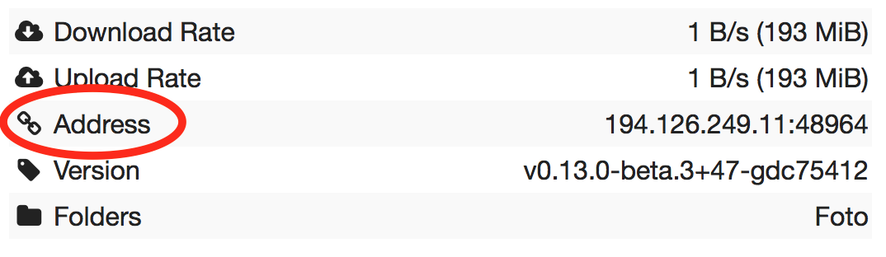

.. role:: strike

.. _faq:

FAQ
===

What is Syncthing?
------------------

Syncthing is an application that lets you synchronize your files across multiple
devices. This means the creation, modification or deletion of files on one
machine will automatically be replicated to your other devices. We believe your
data is your data alone and you deserve to choose where it is stored. Therefore
Syncthing does not upload your data to the cloud but exchanges your data across
your machines as soon as they are online at the same time.

Is it "syncthing", "Syncthing" or "SyncThing"?
----------------------------------------------

It's **Syncthing**, although the command and source repository is spelled
``syncthing`` so it may be referred to in that way as well. It's definitely not
:strike:`SyncThing`, even though the abbreviation ``st`` is used in some
circumstances and file names.

How does Syncthing differ from BitTorrent/Resilio Sync?
-------------------------------------------------------

The two are different and not related. Syncthing and BitTorrent/Resilio Sync accomplish
some of the same things, namely syncing files between two or more computers.

BitTorrent Sync, now called Resilio Sync, is a proprietary peer-to-peer file
synchronization tool available for Windows, Mac, Linux, Android, iOS, Windows
Phone, Amazon Kindle Fire and BSD. [#resiliosync]_ Syncthing is an open source file
synchronization tool.

Syncthing uses an open and documented protocol, and likewise the security
mechanisms in use are well defined and visible in the source code. Resilio
Sync uses an undocumented, closed protocol with unknown security properties.

.. [#resiliosync] https://en.wikipedia.org/wiki/Resilio_Sync

What things are synced?
-----------------------

The following things are *always* synchronized:

-  File contents
-  File modification times

The following may be synchronized or not, depending:

-  File permissions (when supported by file system; on Windows only the
   read only bit is synchronized)
-  Symbolic links (synced, except on Windows, but never followed)

The following are *not* synchronized;

-  File or directory owners and Groups (not preserved)
-  Directory modification times (not preserved)
-  Hard links and Windows directory junctions (followed, not preserved)
-  Extended attributes, resource forks (not preserved)
-  Windows, POSIX or NFS ACLs (not preserved)
-  Devices, FIFOs, and other specials (ignored)
-  Sparse file sparseness (will become sparse, when supported by the OS & filesystem)

Is synchronization fast?
------------------------

Syncthing segments files into pieces, called blocks, to transfer data from one
device to another. Therefore, multiple devices can share the synchronization
load, in a similar way to the torrent protocol. The more devices you have online,
the faster an additional device will receive the data
because small blocks will be fetched from all devices in parallel.

Syncthing handles renaming files and updating their metadata in an efficient
manner. This means that renaming a large file will not cause a retransmission of
that file. Additionally, appending data to existing large files should be
handled efficiently as well.

:ref:`Temporary files <temporary-files>` are used to store partial data
downloaded from other devices. They are automatically removed whenever a file
transfer has been completed or after the configured amount of time which is set
in the configuration file (24 hours by default).

Why is the sync so slow?
------------------------

When troubleshooting a slow sync, there are a number of things to check.

First of all, verify that you are not connected via a relay. In the "Remote
Devices" list on the right side of the GUI, double check that you see
"Address: <some address>" and *not* "Relay: <some address>".

If you are connected via a relay, this is because a direct connection could
not be established. Double check and follow the suggestions in
:ref:`firewall-setup` to enable direct connections.

Second, if one of the devices is a very low powered machine (a Raspberry Pi,
or a phone, or a NAS, or similar) you are likely constrained by the CPU on
that device. See the next question for reasons Syncthing likes a faster CPU.

Third, verify that the network connection is OK. Tools such as iperf or just
an Internet speed test can be used to verify the performance here.

Why does it use so much CPU?
----------------------------

#. When new or changed files are detected, or Syncthing starts for the
   first time, your files are hashed using SHA-256.

#. Data that is sent over the network is compressed (optionally) and
   encrypted (always). When receiving data it must be decrypted and then (if
   compressed) decompressed.

#. There is a certain amount of housekeeping that must be done to track the
   current and available versions of each file in the index database.

#. By default Syncthing uses periodic scanning every hour when watching for
   changes or every minute if that's disabled to detect
   file changes. This means checking every file's modification time and
   comparing it to the database. This can cause spikes of CPU usage for large
   folders.

Hashing, compression and encryption cost CPU time. Also, using the GUI
causes a certain amount of extra CPU usage to calculate the summary data it
presents. Note however that once things are *in sync* CPU usage should be
negligible.

To minimize the impact of this, Syncthing attempts to :ref:`lower the
process priority <set-low-priority>` when starting up.

To further limit the amount of CPU used when syncing and scanning, set the
environment variable ``GOMAXPROCS`` to the maximum number of CPU cores
Syncthing should use at any given moment. For example, ``GOMAXPROCS=2`` on a
machine with four cores will limit Syncthing to no more than half the
system's CPU power.

Should I keep my device IDs secret?
-----------------------------------

No. The IDs are not sensitive. Given a device ID it's possible to find the IP
address for that device, if global discovery is enabled on it. Knowing the device
ID doesn't help you actually establish a connection to that device or get a list
of files, etc.

For a connection to be established, both devices need to know about the other's
device ID. It's not possible (in practice) to forge a device ID. (To forge a
device ID you need to create a TLS certificate with that specific SHA-256 hash.
If you can do that, you can spoof any TLS certificate. The world is your
oyster!)

.. seealso::
    :ref:`device-ids`

What if there is a conflict?
----------------------------

Syncthing does recognize conflicts. When a file has been modified on two devices
simultaneously and the content actually differs, one of the files will be
renamed to ``<filename>.sync-conflict-<date>-<time>-<modifiedBy>.<ext>``. The file with the
older modification time will be marked as the conflicting file and thus be
renamed. If the modification times are equal, the file originating from the
device which has the larger value of the first 63 bits for its device ID will be
marked as the conflicting file.
If the conflict is between a modification and a deletion of the file, the
modified file always wins and is resurrected without renaming on the
device where it was deleted.

Beware that the ``<filename>.sync-conflict-<date>-<time>-<modifiedBy>.<ext>`` files are
treated as normal files after they are created, so they are propagated between
devices. We do this because the conflict is detected and resolved on one device,
creating the ``sync-conflict`` file, but it's just as much of a conflict
everywhere else and we don't know which of the conflicting files is the "best"
from the user point of view.

.. _marker-faq:

How do I serve a folder from a read only filesystem?
----------------------------------------------------

Syncthing requires a "folder marker" to indicate that the folder is present
and healthy. By default this is a directory called ``.stfolder`` that is
created by Syncthing when the folder is added. If this folder can't be
created (you are serving files from a CD or something) you can instead set
the advanced config ``Marker Name`` to the name of some file or folder that
you know will always exist in the folder.

I really hate the ``.stfolder`` directory, can I remove it?
-----------------------------------------------------------

See the previous question.

Am I able to nest shared folders in Syncthing?
----------------------------------------------

Sharing a folder that is within an already shared folder is possible, but it has
its caveats. What you must absolutely avoid are circular shares. This is just
one example, there may be other undesired effects. Nesting shared folders is not
supported, recommended or coded for, but it can be done successfully when you
know what you're doing - you have been warned.

How do I rename/move a synced folder?
-------------------------------------

Syncthing doesn't have a direct way to do this, as it's potentially
dangerous to do so if you're not careful - it may result in data loss if
something goes wrong during the move and is synchronized to your other
devices.

The easy way to rename or move a synced folder on the local system is to
remove the folder in the Syncthing UI, move it on disk, then re-add it using
the new path.

It's best to do this when the folder is already in sync between your
devices, as it is otherwise unpredictable which changes will "win" after the
move. Changes made on other devices may be overwritten, or changes made
locally may be overwritten by those on other devices.

An alternative way is to shut down Syncthing, move the folder on disk (including
the ``.stfolder`` marker), edit the path directly in ``config.xml`` in the
configuration folder (see :ref:`config`) and then start Syncthing again.

How do I configure multiple users on a single machine?
------------------------------------------------------

Each user should run their own Syncthing instance. Be aware that you might need
to configure listening ports such that they do not overlap (see :ref:`config`).

Does Syncthing support syncing between folders on the same system?
------------------------------------------------------------------

No. Syncthing is not designed to sync locally and the overhead involved in
doing so using Syncthing's method would be wasteful. There are better
programs to achieve this such as `rsync <https://rsync.samba.org/>`__ or
`Unison <https://www.cis.upenn.edu/~bcpierce/unison>`__.

When I do have two distinct Syncthing-managed folders on two hosts, how does Syncthing handle moving files between them?
------------------------------------------------------------------------------------------------------------------------

Syncthing does not specially handle this case, and most files most likely get
re-downloaded.

In detail, the behavior depends on the scan order. If you have folder A and B,
and move files from A to B, if A gets scanned first, it will announce removal of
the files to others who will remove the files. As you rescan B, B will
announce addition of new files, and other peers will have nowhere to get
them from apart from re-downloading them.

If B gets rescanned first, B will announce additions first, remote
peers will reconstruct the files (not rename, more like copy block by
block) from A, and then as A gets rescanned remove the files from A.

A workaround would be to copy first from A to B, rescan B, wait for B to
rebuild on remote ends, and then delete from A.

Is Syncthing my ideal backup application?
-----------------------------------------

No. Syncthing is not a great backup application because all changes to your
files (modifications, deletions, etc.) will be propagated to all your
devices. You can enable versioning, but we encourage the use of other tools
to keep your data safe from your (or our) mistakes.

Why is there no iOS client?
---------------------------

There is an alternative implementation of Syncthing (using the same network
protocol) called ``fsync()``. There are no plans by the current Syncthing
team to support iOS in the foreseeable future, as the code required to do so
would be quite different from what Syncthing is today.

How can I exclude files with brackets (``[]``) in the name?
-----------------------------------------------------------

The patterns in .stignore are glob patterns, where brackets are used to
denote character ranges. That is, the pattern ``q[abc]x`` will match the
files ``qax``, ``qbx`` and ``qcx``.

To match an actual file *called* ``q[abc]x`` the pattern needs to "escape"
the brackets, like so: ``q\[abc\]x``.

On Windows, escaping special characters is not supported as the ``\``
character is used as a path separator. On the other hand, special characters
such as ``[`` and ``?`` are not allowed in file names on Windows.

Why is the setup more complicated than BitTorrent/Resilio Sync?
---------------------------------------------------------------

Security over convenience. In Syncthing you have to setup both sides to
connect two devices. An attacker can't do much with a stolen device ID, because
you have to add the device on the other side too. You have better control
where your files are transferred.

This is an area that we are working to improve in the long term.

How do I access the web GUI from another computer?
--------------------------------------------------

The default listening address is 127.0.0.1:8384, so you can only access the
GUI from the same machine. This is for security reasons. Change the ``GUI
listen address`` through the web UI from ``127.0.0.1:8384`` to
``0.0.0.0:8384`` or change the config.xml:

.. code-block:: xml

    <gui enabled="true" tls="false">
      <address>127.0.0.1:8384</address>

to

.. code-block:: xml

    <gui enabled="true" tls="false">
      <address>0.0.0.0:8384</address>

Then the GUI is accessible from everywhere. You should set a password and
enable HTTPS with this configuration. You can do this from inside the GUI.

If both your computers are Unix-like (Linux, Mac, etc.) you can also leave the
GUI settings at default and use an ssh port forward to access it. For
example,

.. code-block:: bash

    $ ssh -L 9090:127.0.0.1:8384 user@othercomputer.example.com

will log you into othercomputer.example.com, and present the *remote*
Syncthing GUI on http://localhost:9090 on your *local* computer.

If you only want to access the remote gui and don't want the terminal
session, use this example,

.. code-block:: bash

    $ ssh -N -L 9090:127.0.0.1:8384 user@othercomputer.example.com

If only your remote computer is Unix-like,
you can still access it with ssh from Windows.

Under Windows 10 (64 bit) you can use the same ssh command if you install
the `Windows Subsystem for Linux <https://docs.microsoft.com/windows/wsl/install-win10>`__.

Another Windows way to run ssh is to install `gow (Gnu On Windows) <https://github.com/bmatzelle/gow>`__. The easiest way to install gow is with the `chocolatey <https://chocolatey.org/>`__ package manager.

Why do I get "Host check error" in the GUI/API?
-----------------------------------------------

Since version 0.14.6 Syncthing does an extra security check when the GUI/API
is bound to localhost - namely that the browser is talking to localhost.
This protects against most forms of `DNS rebinding attack
<https://en.wikipedia.org/wiki/DNS_rebinding>`__ against the GUI.

To pass this test, ensure that you are accessing the GUI using an URL that
begins with `http://localhost`, `http://127.0.0.1` or `http://[::1]`. HTTPS
is fine too, of course.

If you are using a proxy in front of Syncthing you may need to disable this
check, after ensuring that the proxy provides sufficient authentication to
protect against unauthorized access. Either:

- Make sure the proxy sets a `Host` header containing `localhost`, or
- Set `insecureSkipHostcheck` in the advanced settings, or
- Bind the GUI/API to a non-localhost listen port.

In all cases, username/password authentication and HTTPS should be used.

My Syncthing database is corrupt
--------------------------------

This is almost always a result of bad RAM, storage device or other hardware. When the index database is found to be corrupt Syncthing cannot operate and will note this in the logs and exit. To overcome this delete the `database folder <https://docs.syncthing.net/users/config.html#description>`__ inside Syncthing's home directory and re-start Syncthing. It will then need to perform a full re-hashing of all shared folders. You should check your system in case the underlying cause is indeed faulty hardware which may put the system at risk of further data loss.

I don't like the GUI or the theme. Can it be changed?
-----------------------------------------------------

You can change the theme in the settings. Syncthing ships with other themes
than the default.

If you want a custom theme or a completely different GUI, you can add your
own.
By default, Syncthing will look for a directory ``gui`` inside the Syncthing
home folder. To change the directory to look for themes, you need to set the
STGUIASSETS environment variable. To get the concrete directory, run
syncthing with the ``-paths`` parameter. It will print all the relevant paths,
including the "GUI override directory".

To add e.g. a red theme, you can create the file ``red/assets/css/theme.css``
inside the GUI override directory to override the default CSS styles.

To create a whole new GUI, you should checkout the files at
https://github.com/syncthing/syncthing/tree/main/gui/default
to get an idea how to do that.

Why do I see Syncthing twice in task manager?
---------------------------------------------

One process manages the other, to capture logs and manage restarts. This
makes it easier to handle upgrades from within Syncthing itself, and also
ensures that we get a nice log file to help us narrow down the cause for
crashes and other bugs.

Where do Syncthing logs go to?
------------------------------

Syncthing logs to stdout by default. On Windows Syncthing by default also
creates ``syncthing.log`` in Syncthing's home directory (run ``syncthing
-paths`` to see where that is). Command line option ``-logfile`` can be used
to specify a user-defined logfile.

How can I view the history of changes?
--------------------------------------

The web GUI contains a ``Global Changes`` button under the device list which
displays changes since the last (re)start of Syncthing. With the ``-audit``
option you can enable a persistent, detailed log of changes and most
activities, which contains a ``JSON`` formatted  sequence of events in the
``~/.config/syncthing/audit-_date_-_time_.log`` file.

Does the audit log contain every change?
----------------------------------------

The audit log (and the ``Global Changes`` window) sees the changes that your
Syncthing sees. When Syncthing is continuously connected it usually sees every change
happening immediately and thus knows which node initiated the change.
When topology gets complex or when your node reconnects after some time offline,
Syncthing synchronises with its neighbours: It gets the latest synchronised state
from the neighbour, which is the *result* of all the changes between the last
known state (before disconnect or network delay) and the current state at the
neighbour, and if there were updates, deletes, creates, conflicts, which were
overlapping we only see the *latest change* for a given file or directory (and
the node where that latest change occurred). When we connect to multiple neighbours
Syncthing decides which neighbor has the latest state, or if the states conflict
it initiates the conflict resolution procedure, which in the end results in a consistent
up-to-date state with all the neighbours.

How do I upgrade Syncthing?
---------------------------

If you use a package manager such as Debian's apt-get, you should upgrade
using the package manager. If you use the binary packages linked from
Syncthing.net, you can use Syncthing built in automatic upgrades.

- If automatic upgrades is enabled (which is the default), Syncthing will
  upgrade itself automatically within 24 hours of a new release.

- The upgrade button appears in the web GUI when a new version has been
  released. Pressing it will perform an upgrade.

- To force an upgrade from the command line, run ``syncthing -upgrade``.

Note that your system should have CA certificates installed which allow a
secure connection to GitHub (e.g. FreeBSD requires ``sudo pkg install
ca_root_nss``). If ``curl`` or ``wget`` works with normal HTTPS sites, then
so should Syncthing.

Where do I find the latest release?
-----------------------------------

We release new versions through GitHub. The latest release is always found
`on the release page
<https://github.com/syncthing/syncthing/releases/latest>`_. Unfortunately
GitHub does not provide a single URL to automatically download the latest
version. We suggest to use the `GitHub API <https://api.github.com/repos/syncthing/syncthing/releases/latest>`__ and parsing
the JSON response.

How do I run Syncthing as a daemon process on Linux?
----------------------------------------------------

If you're using systemd, runit, or upstart, we ship `example configurations <https://github.com/syncthing/syncthing/tree/main/etc>`__.

If however you're not using one of these tools, you have a couple of options.
If your system has a tool called ``start-stop-daemon`` installed (that's the name
of the command, not the package), look into the local documentation for that, it
will almost certainly cover 100% of what you want to do.  If you don't have
``start-stop-daemon``, there are a bunch of other software packages you could use
to do this.  The most well known is called daemontools, and can be found in the
standard package repositories for  almost every modern Linux distribution.
Other popular tools with similar functionality include S6 and the aforementioned
runit.

.. _inotify-limits:

How do I increase the inotify limit to get my filesystem watcher to work?
-------------------------------------------------------------------------

You are probably reading this because you encountered the following error with
the filesystem watcher on linux:

    Failed to start filesystem watcher for folder yourLabel (yourID): failed to
    setup inotify handler. Please increase inotify limits, see https://docs.syncthing.net/users/faq.html#inotify-limits

Linux typically restricts the amount of watches per user (usually 8192). When
you have more directories you need to adjust that number.

On many Linux distributions you can run the following to fix it::

    echo "fs.inotify.max_user_watches=204800" | sudo tee -a /etc/sysctl.conf

On Arch Linux and potentially others it is preferred to write this line into a
separate file, i.e. you should run::

    echo "fs.inotify.max_user_watches=204800" | sudo tee -a /etc/sysctl.d/90-override.conf

This only takes effect after a reboot. To adjust the limit immediately, run::

    sudo sh -c 'echo 204800 > /proc/sys/fs/inotify/max_user_watches'

How do I reset the GUI password?
--------------------------------

If you've forgotten/lost the GUI password, you can remove it by deleting the **<user>** and **<password>** XML tags from the **<gui>** block in file ``config.xml``. This should be done while Syncthing is not running. The location of the file depends on OS and is described in the configuration documentation.

For example, the two emphasized lines below would be removed from the file.

.. code-block:: text
    :emphasize-lines: 3,4

    <gui enabled="true" tls="false" debugging="false">
       <address>127.0.0.1:8384</address>
       <user>syncguy</user>
       <password>$2a$10$s9wWHOQe...Cq7GPye69</password>
       <apikey>9RCKohqCAyrj5RjpyZdR2wXmQ9PyQFeN</apikey>
       <theme>default</theme>
    </gui>
