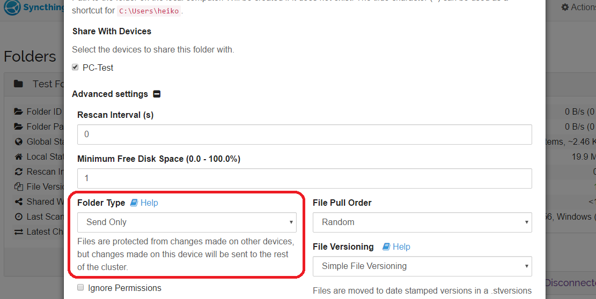
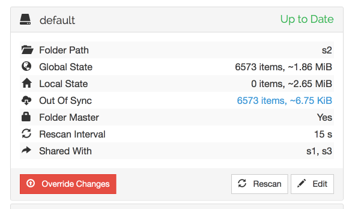

.. _folder-types:

Folder Types
============

Send & Receive Folder
---------------------

This is the standard folder type. Under this setting, a folder will both send 
changes to and receive changes from remote devices.

.. _folder-sendonly:

Send Only Folder
----------------

A folder can be set in "send-only mode" among the folder settings.

The intention is for this to be used on devices where a "master copy" of
files are kept - where the files are not expected to be changed on other
devices or where such changes would be undesirable.

In send-only mode, all changes from other devices in the cluster are
ignored. Changes are still *received* so the folder may become "out of
sync", but no changes will be applied.

When a send-only folder becomes out of sync, a red "Override Changes"
button is shown at the bottom of the folder details.

Clicking this button will enforce this host's current state on the
rest of the cluster. Any changes made to files will be overwritten by
the version on this host, any files that don't exist on this host will
be deleted, and so on.
