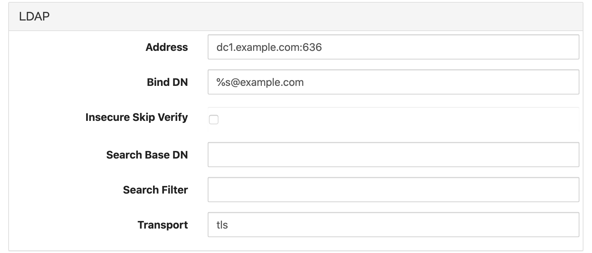
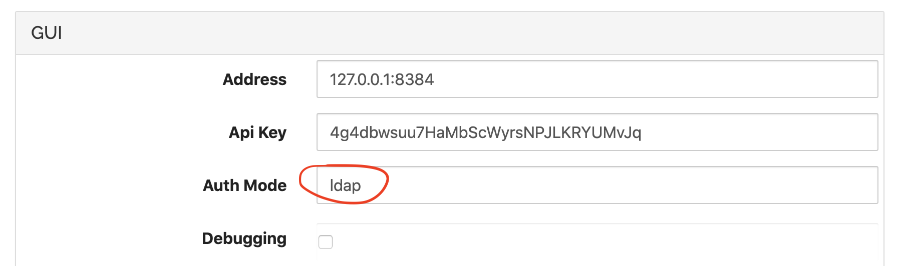
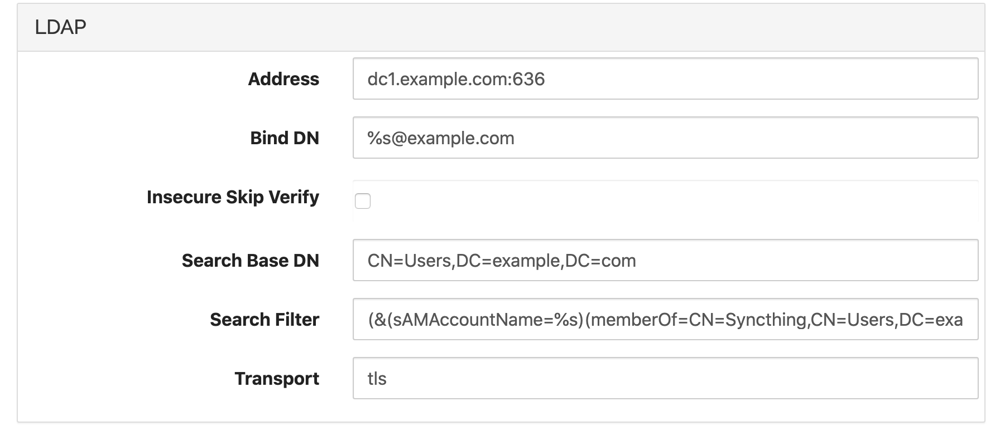

LDAP Authentication
===================

Syncthing can be configured to delegate authentication to an external LDAP
source. Typical examples include Microsoft Active Directory and OpenLDAP /
OpenDirectory servers.

To enable LDAP authentication some configuration options must be set in the
advanced config editor. Under "Actions > Advanced", select and expand the LDAP tab.
The following options are available:

``Address``
    Set to the address of the LDAP server, with hostname and port. For
    example, ``dc1.example.com:389`` for standard LDAP, or
    ``dc1.example.com:636`` for LDAPS. (See also ``Transport``)

``Bind DN``
    This is the pattern for the bind user. The special token ``%s`` must be
    inserted to represent the username entered by the user at the login
    prompt. Typical examples are ``%s@ad.example.com`` for Active Directory
    or something like ``CN=%s,CN=Users,DC=example,DC=com`` for standard LDAP
    servers.

``Insecure Skip Verify``
    When set, this option disables all certificate verification for LDAPS.
    Use with care and only when absolutely necessary.

``Search Base DN``
    Optional, base DN to use for user searches. See :ref:`groupmembership`
    below.

``Search Filter``
    Optional, search filter to use for user searches. See
    :ref:`groupmembership` below.

``Transport``
    Set to ``plain`` for unencrypted LDAP (port 389), ``tls`` for LDAPS
    (port 636), or ``starttls`` for Start TLS (port 389 typically).

A simple setup might look like this:

Once these settings are correct, LDAP authentication must be **enabled** by
setting the authentication mode to ``ldap`` in the advanced GUI
configuration:

.. _groupmembership:

Enforcing Group Membership
--------------------------

.. versionadded:: 1.5.0

In some cases it may be desirable to restrict login to members of a certain
group. We do this by using a custom search filter that matches users who
belong to the group only.

We need to know three things to specify the required search:

1. The base DN under which users are stored. This can be something like
   ``CN=Users,DC=example,DC=com`` for AD, or it can be a specific OU for a
   subset of users.
2. The DN for the group we need to match, and the user attribute that stores
   group memberships. This varies depending on the LDAP schema and layout, for
   AD the membership attribute is ``memberOf``.
3. The attribute that stores the user ID that the user enters at the login
   prompt. Again this varies, and it can be either ``CN``, ``UID``, or
   something else. For AD it is ``sAMAccountName``.

With these at hand we can enter the base DN in the ``Search Base DN``
configuration option, and build our search filter. The search filter needs
to match both the user ID and the group membership. For an AD setup with a
group ``Syncthing`` in the standard location, a valid search filter is::

    (&
      (sAMAccountName=%s)
      (memberOf=CN=Syncthing,CN=Users,DC=example,DC=com)
      )

Line breaks for clarity only. We enter this as one long string. For example,
like this:

