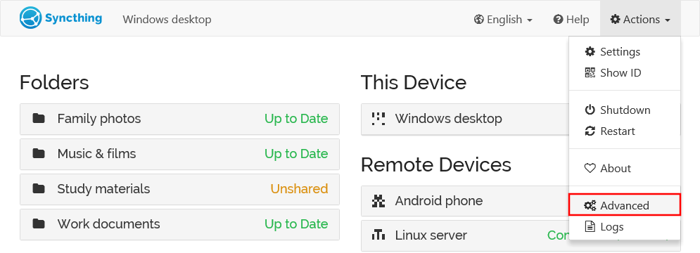
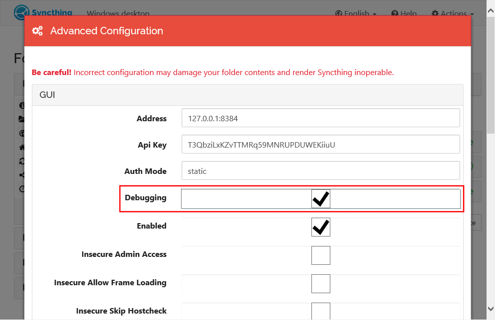

Profiling
=========

.. note::
    Hi! If you're here because some developer told you to "grab a profile"
    and pointed to this page - welcome, and don't worry! The procedure is
    quick and painless.

Profiling is the process of figuring out what a program is doing -- where
it's spending its time on the CPU and why it's allocated memory. The
profiles are of two types - the "CPU profile" which shows which functions
are using most CPU time and the "heap profile" that shows which functions
have caused most memory to be allocated.

Neither of the profiles contain any private data about your setup - only
what parts of the program are using resources.

Enable Debugging
----------------

Debugging must be enabled to be able to capture profiles. To enable
debugging, open the advanced settings:

Enable the "debugging" setting under "GUI", and then scroll down and **Save**.
No restart is necessary.

Capture a CPU profile
---------------------

To get a CPU profile you need to visit a URL ending in
``/rest/debug/cpuprof``. Assuming you are on the same computer as Syncthing
and using the default settings, you should be able to do that by just
clicking `<http://localhost:8384/rest/debug/cpuprof>`__ -- otherwise please
adjust the host name and port as necessary.

The profiling starts when the page is requested and takes 30 seconds. During
this time it will seem like nothing is happening and the browser is just
waiting, hung, or "spinning". Don't worry - leave it be and have patience.
Once done the profiling will result in a download called something like
``syncthing-cpu-windows-amd64-v0.14.4-112233.pprof``. This is the file to
keep and send in, without modifying the file name as it tells us information
necessary to interpret it.

Repeat the process twice and keep both files.

Capture a heap profile
----------------------

To get a heap profile you need to visit a URL ending in
``/rest/debug/heapprof``. The procedure is otherwise identical to the process
for the CPU profile above, except the heap profile is downloaded
instantaneously.

Assuming you are on the same computer as Syncthing
and using the default settings, you should be able to do that by just
clicking `<http://localhost:8384/rest/debug/heapprof>`__ -- otherwise please
adjust the host name and port as necessary.

The profiling will result in a download called something like
``syncthing-heap-windows-amd64-v0.14.4-112233.pprof``. This is the file to
keep and send in, without modifying the file name as it tells us information
necessary to interpret it.

Repeat the process twice and keep both files.
