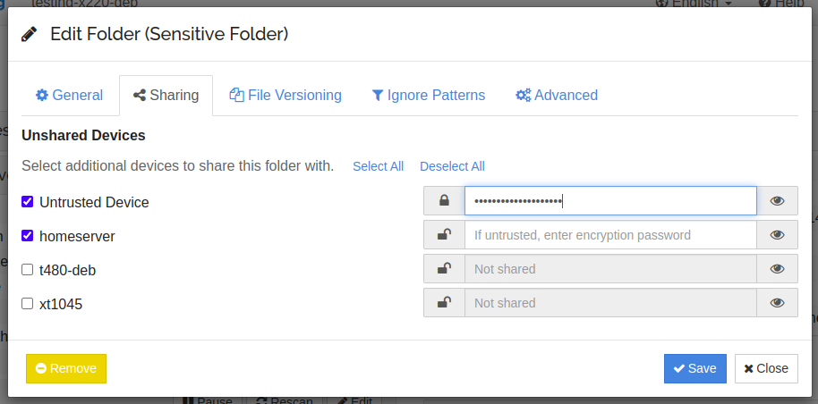

.. warning::
   This feature should still be considered beta / testing only.

Untrusted (Encrypted) Devices
=============================

It is possible to set a password on a folder when it's shared with another
device. Data sent will be encrypted by this password, and data received will
be decrypted by the same password.

.. note::

    The data is encrypted using both the password and the folder ID. You
    shouldn't ever need the folder ID as it's stored in the folder marker,
    however to be on the safe side make sure you store both securely and
    reliably.

As an example, let's assume a *trusted* device ``T1``, maybe your laptop. You
have sensitive documents here but they are in cleartext from Syncthing's
point of view (perhaps protected by full disk encryption). There is also an
*untrusted* device ``U1``, perhaps a cloud server, where we want to sync
data but in unreadable form.

We set a folder password on ``T1`` when sharing the folder with ``U1``. Data
on disk on ``T1`` is not affected, but data sent to ``U1`` becomes encrypted
-- garbage, if you don't know the password.

.. graphviz::
    :align: center

    digraph g {
        rankdir=LR
        "T1" [label="T1\n(Clear text)", style=filled, color="/accent3/1"]
        "U1" [label="U1\n(Encrypted)", style=filled, color="/accent3/2"]

        T1 -> U1 [label="Encrypted by T1"]
        U1 -> T1 [label="Decrypted by T1"]
    }

From this setup it's also possible to add further trusted devices, say
``T2``, and have these sync the data from the untrusted device ``U1``
without being in contact with ``T1``. Using the *same folder password* on
``T2`` makes the existing data on ``U1`` intelligible and the plaintext data
becomes available.

.. graphviz::
    :align: center

    digraph g {
        rankdir=LR
        "T1" [style=filled, color="/accent3/1"]
        "U1" [style=filled, color="/accent3/2"]
        "T2" [style=filled, color="/accent3/1"]

        T1 -> U1 [label="Encrypted by T1"]
        U1 -> T1 [label="Decrypted by T1"]
        U1 -> T2 [label="Decrypted by T2"]
        T2 -> U1 [label="Encrypted by T2"]
    }

Similarly, it's fine to add "normal mode" synchronization between untrusted devices.

.. graphviz::
    :align: center

    digraph g {
        rankdir=LR
        "T1" [style=filled, color="/accent3/1"]
        "U1" [style=filled, color="/accent3/2"]
        "T2" [style=filled, color="/accent3/1"]
        "U2" [style=filled, color="/accent3/2"]

        T1 -> U1 [label="Encrypted by T1"]
        U1 -> T1 [label="Decrypted by T1"]
        T2 -> U2 [label="Encrypted by T2"]
        U2 -> T2 [label="Decrypted by T2"]
        U1 -> U2 [dir="both"];

        subgraph U {
            rank="same"
            U1
            U2
        }
    }

Configuration
-------------

GUI
~~~

On a trusted device you can set a password for a device and folder in the share
tab of folder and device edit dialogs. To share a folder to a trusted device,
you simply leave the password field empty. For an untrusted device, enter a
password. You can click on the eye to toggle the password visibility.

For a single device, it is possible to share different folders both in the
usual way and encrypted. This may be useful, if you have one folder with
sensitive data, that you do not want another device to read, and another folder
with data that is unproblematic. If you never want to sync any unencrypted data
to a particular device, you can mark it as untrusted in the advanced tab of the
device edit dialog. This will prevent a connection to that device if you forget
to set a password on any folder shared with it.

On untrusted devices, you need to set the folder type to "Receive Encrypted".

config.xml
~~~~~~~~~~

This is the configuration on a trusted device. Here the folder ``default``
is shared with three devices. The device ``373HSRP`` is a traditional
trusted peer. The other two devices ``CJBIJBJ`` and ``I6KAH76`` are both
untrusted and will get encrypted folder data, using different passwords.

.. code-block:: text

    <folder id="default" ...>
        <device id="373HSRP-...">
            <encryptionPassword></encryptionPassword>
        </device>
        <device id="CJBIJBJ-...">
            <encryptionPassword>foo</encryptionPassword>
        </device>
        <device id="I6KAH76-...">
            <encryptionPassword>bar</encryptionPassword>
        </device>
    </folder>

On untrusted devices the :stconf:opt:`type of the folders <folder.type>` has to
be ``receiveencrypted``.

Caveats
-------

The untrusted device must not be able to compare encrypted data between
different files and detect if data is equal. This means that blocks cannot as
usual be reused between files. When a file is changed, blocks from the old file
can still be reused. As an example, if you rename a file ``foo`` to ``Foo``
syncthing will usually do an efficient rename or at least copy all the data
before deleting the old one. On an untrusted device, it will delete the old file
and receive the data for the new file over the network. However if you have a big file,
e.g. ``video.mp4``, and you modify just a part of it (e.g. video metadata), only
the changed block is transferred as usual.

.. _untrusted-decrypt:

Decrypting data
---------------

Say you recovered a backup or lost the Syncthing database on an untrusted
device, and need to get the plaintext data. To do that there's a command to
convert the encrypted data to plaintext on disk. Meaning you should only do that
on a trusted device. To decrypt the data, run the following command pointed at
the root of the encrypted folder:

.. code-block:: bash

    $ syncthing decrypt --to <plaintext-destination> --password <your-password> <encrypted-folder-path>

Technicals
----------

The following things are encrypted / hidden / protected on untrusted devices:

- File data
- File metadata, including name, times and hashes
- File structure (your directory structure is not replicated, even in
  encrypted-name form)

The following things are *not* protected:

- Folder ID and label
- File sizes (files grow a little on the encrypted side compared to the
  plaintext original, but it's still easy to derive the original size from the
  encrypted file)

Encryption is XChaCha20-Poly1305 and AES-SIV with a key derived from the
password and folder ID using scrypt. Refer to :ref:`untrusted` for details.

Untrusted Side File Structure
~~~~~~~~~~~~~~~~~~~~~~~~~~~~~

The directory structure on the untrusted side doesn't follow that of the
plaintext hierarchy. Instead file names are encrypted as a whole, with their
full path within the folder, and then split into a logical structure. As an
example, the name ``foo.txt`` (in the folder root) might encrypt to
``S21K3P1VJO08DEQJ1DQJE0DLOMT068JJFD857L8ODM2TAKI3CC``. On disk this gets split
into a top level directory with a file extension, a second level directory, and
the rest:

.. graphviz::
    :align: center

    graph {
        "folder" [shape=folder]
        "S.syncthing-enc" [shape=folder]
        "21" [shape=folder]
        "K3P1VJO0..." [shape=file]

        "folder" -- "S.syncthing-enc"
        "S.syncthing-enc" -- "21"
        "21" -- "K3P1VJO0..."
    }

The upper level directories serve to combine files, avoiding issues that might
arise with having too many files in a single directory.

Similarly, a file with the name ``Documents/Project/My project.docx`` might
encrypt to ``IKFEDO9653D8ON1L776EUI286CPD1C...``.
With the same system as above this file gets placed as:

.. graphviz::
    :align: center

    graph {
        "folder" [shape=folder]
        "I.syncthing-enc" [shape=folder]
        "KF" [shape=folder]
        "EDO9653D..." [shape=file]
        "S.syncthing-enc" [shape=folder, color=grey]
        "21" [shape=folder, color=grey]
        "K3P1VJO0..." [shape=file, color=grey]

        "folder" -- "I.syncthing-enc"
        "I.syncthing-enc" -- "KF"
        "KF" -- "EDO9653D..."
        "folder" -- "S.syncthing-enc" [color=grey]
        "S.syncthing-enc" -- "21" [color=grey]
        "21" -- "K3P1VJO0..." [color=grey]
    }

Even longer files get split into deeper directories, and files sharing
(encrypted) first characters in the name will end up beside each other --
regardless of their original placement in the folder.
